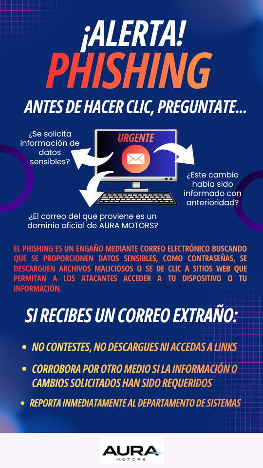

# Estrategia de Concientización: Mitigación de Phishing v1.0 

### **Framework:** Alineado a ISO/1EC 27001:2022 (Control A.6.3) y NIST CSF (PR.AT-1)

## Objetivo del proyecto

Diseñar y estructurar un acampaña de concientización integral para reducir el Factor de Riesgo Humano (Human Risk) ante ataques de **Ingenieria social** (phishing), estableciendo métricas de control y materiales educativos accionables.

## Análisis del Problema

El 905 de las brechas de ciberseguridad inician con un error humano. Este proyecto aborda la vulnerabilidad desde la **Cultura de Seguridad**, transformando al colaborador de un "punto débil" a un "agente de detección".

## Componentes de la Campaña (Entregables)

**1. Material Eduactivo: "Anatomía de un phishing"**
   * **Formato:** Infografía de alto impacto, alineada visualmente a la imagen corporativa de la empresa.
   * **Propósito:** Capacitación visual rápida sobre qué es el Phishing, cuales son las alertas básicas y que hacer en caso de detectarlo.

La infografía se enfoca en presentar 3 pilares de detección comunes, sugeridos como cuestionamientos personales que puede realizarse el usuario que recibe el correo malicioso:
   * Validación de datos: Identificación de solicitud e información sensible
   * Verificación de origen: Comprobación de dominios oficiales
   * Contexto de comunicación: Confirmación de cambios informados previamente

**2. Simulación de Ataque (Phishing Simulation)**

Para evaluar la efectividad de la campaña y obtener la **Línea Base (Baseline)** de la cultura de seguridad, se diseñó el siguiente correo electrónico de simulación basado en tácticas de ingeniería social.

---

> **Asunto:** ⚠️ ACCIÓN REQUERIDA: Actualización de Credenciales - AURA MOTORS  
> **De:** Soporte Técnico `<it-security@aura-motors-soporte.com>`  
> **Fecha:** 21 de Marzo de 2026, 09:00 AM  
> 
> **Estimado colaborador,**
> 
> Hemos detectado un intento de inicio de sesión inusual en su cuenta desde una ubicación no reconocida. Por políticas de seguridad de **Aura Motors**, es obligatorio que realice la validación de sus credenciales en las próximas **2 horas** para evitar la suspensión temporal de su acceso a los sistemas internos.
> 
> Por favor, haga clic en el siguiente botón para confirmar su identidad y actualizar su contraseña:
> 
> [ 🔒 ACTUALIZAR MI CONTRASEÑA AQUÍ ](http://bit.ly/login-aura-motors-secure)
> 
> Si no realiza esta acción, su cuenta será bloqueada automáticamente por el protocolo de protección de activos.
> 
> *Atentamente,* > **Departamento de Sistemas y Ciberseguridad** > *Aura Motors S.A. de C.V.*

---

#### 🔍 Análisis Técnico del Vector de Ataque (Red Flags)

Este correo fue diseñado para contener **4 señales de alerta** que se alinean con la infografía educativa del proyecto:

1. **Remitente Externo (Spoofing de Dominio):** El dominio oficial es `@auramotors.com`, pero el correo proviene de `@aura-motors-soporte.com`. Se utiliza un dominio "primo" para generar falsa confianza.
2. **Sentido de Urgencia (Pressure Tactic):** El límite de "2 horas" busca desactivar el pensamiento crítico del colaborador, forzando una reacción impulsiva.
3. **Enlace Enmascarado (URL Shortener):** El uso de `bit.ly` oculta el destino real del sitio, una técnica común para evadir filtros de seguridad básicos.
4. **Amenaza de Consecuencia Negativa:** El aviso de "suspensión de cuenta" es un disparador psicológico de miedo que aumenta la probabilidad de clic.

## Marco de Medición (KPIs Sugeridos)

Para validadr la efectividad de la campaña, se propone el monitoreo de los siguientes indicadores:

| Indicador (KPI) | Definición Técnica | Objetivo (Target) | Impacto en GRC |
| :--- | :--- | :--- | :--- |
| **Phish-prone %** | Porcentaje de usuarios que interactúan con el enlace malicioso. | < 5% en 90 días | Reducción de la superficie de ataque. |
| **Reporting Rate** | Porcentaje de usuarios que notifican el correo sospechoso al SOC/TI. | > 45% de la muestra | Fortalecimiento de la capacidad de detección. |
| **Time to Report** | Tiempo transcurrido entre el envío del correo y el primer reporte. | < 15 minutos | Mejora en los tiempos de respuesta a incidentes. |
| **Coverage Rate** | Porcentaje del personal que completó la lectura del material. | 100% (Personal crítico) | Cumplimiento normativo (ISO/NIST). |

## Cumplimiento y Normativa
Este proyecto apoya el cumplimiento de los siguientes marcos legales y técnicos:
   * **ISO 27001:** Control de concientización y formación.
   * **NIST CSF:** User Training and Awareness.
   * **Ley Federal de Protección a Datos Personales en Poseción de los Particulares (México):** Medidas de seguridad administrativas para la protección de datos personales
